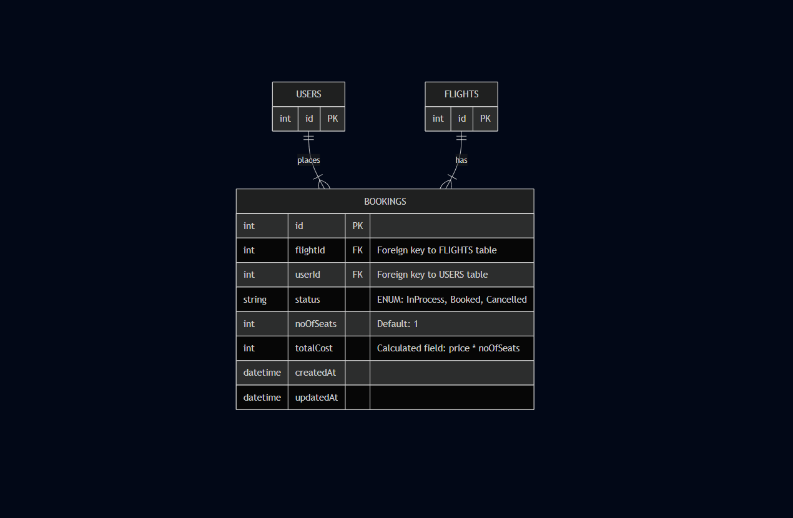

# Airline Booking Service

A microservice for handling flight bookings, built with Node.js, Express, and Sequelize. This service is a core component of the Airline Management System, responsible for managing the entire booking lifecycle. It communicates with other services, such as a Flight Service, to ensure data consistency and uses a message broker for asynchronous tasks.

---



## Features

- **Booking Creation:** Allows users to book flights by providing flight and user details.
- **Integration with Flight Service:** Communicates with an external Flight Service via REST API to:
  - Fetch real-time flight data, including price and seat availability.
  - Automatically update the number of available seats on a flight after a booking is confirmed.
- **Asynchronous Messaging:** Utilizes **RabbitMQ** to publish messages for tasks like sending notifications or reminders, decoupling services and improving reliability.
- **Relational Database Management:** Uses Sequelize ORM for robust database migrations, models, and queries with a MySQL database.
- **Structured Error Handling:** Implements custom error classes for different layers (Service, Repository, Validation) to provide clear and informative error responses.

---

## Project Setup

Follow these steps to get the project running on your local machine.

### 1. Prerequisites

- [Node.js](https://nodejs.org/) (v16 or higher)
- A SQL-based database like [MySQL](https://www.mysql.com/).
- [RabbitMQ](https://www.rabbitmq.com/download.html) message broker installed and running.

### 2. Installation

- Clone the project repository:
  ```bash
  git clone <your-repository-url>
  ```
- Navigate to the project's root directory:
  ```bash
  cd <project-directory-name>
  ```
- Install all the required npm packages:
  ```bash
  npm install
  ```

### 3. Environment Configuration

- Create a `.env` file in the root directory. Add the following environment variables, replacing the placeholder values with your specific configuration.

  ```env
  PORT = YOUR_PORT_NUMBERs
  FLIGHT_SERVICE_PATH='lochalhost:XXXX'
  EXCHANGE_NAME=YOUR_EXCHANGE_NAME
  REMINDER_BINDING_KEY=YOUR_BINDING_KEY
  MESSAGE_BROKER_URL='amqp://localhost' #for rabbitMQ
  ```

- Inside the `src/config` folder, rename the `config.json.sample` to `config.json` (or create it if it doesn't exist). Replace the placeholders with your actual database credentials.

  ```json
  {
    "development": {
      "username": "<YOUR_DB_USERNAME>",
      "password": "<YOUR_DB_PASSWORD>",
      "database": "BOOKING_DB_DEV",
      "host": "127.0.0.1",
      "dialect": "mysql"
    }
  }
  ```

### 4. Database Setup

- From the project's root folder in your terminal, run the following Sequelize CLI commands to set up your database and tables.

- Create the database:
  ```bash
  npx sequelize db:create
  ```
- Run the database migrations to create the `Bookings` table and add necessary columns:
  ```bash
  npx sequelize db:migrate
  ```

### 5. Running the Server

- Start the server using the npm script (this will use `nodemon` for automatic restarts during development):

  ````bash
  npm start
  ```- The server should now be running on the port specified in your `.env` file (e.g., `http://localhost:3002`).
  ````

---

## API Endpoints

The service exposes the following RESTful API endpoints, prefixed with `/api/v1`.

| Method | Endpoint    | Description                                                                  | Request Body (JSON)                              |
| :----- | :---------- | :--------------------------------------------------------------------------- | :----------------------------------------------- |
| `POST` | `/bookings` | Creates a new booking for a flight.                                          | `{ "flightId": 1, "userId": 1, "noOfSeats": 2 }` |
| `POST` | `/publish`  | A utility endpoint to publish a test message to the RabbitMQ message broker. | -                                                |
| `GET`  | `/info`     | A simple endpoint to check if the service is running.                        | -                                                |

---

## Custom Error Handling

This project uses a centralized and structured approach to error handling located in the `src/utils/errors` directory.

- **`AppError`**: The base error class that other custom errors extend from.
- **`ValidationError`**: Thrown when incoming request data fails validation checks (e.g., missing required fields). Responds with a `400 Bad Request` status.
- **`ServiceError`**: Represents errors originating from the business logic layer (e.g., insufficient seats, external service failure). Typically responds with an appropriate `4xx` or `5xx` status.

This system ensures that API responses for errors are consistent, predictable, and provide meaningful explanations, which aids in debugging and improves the client-side experience.
